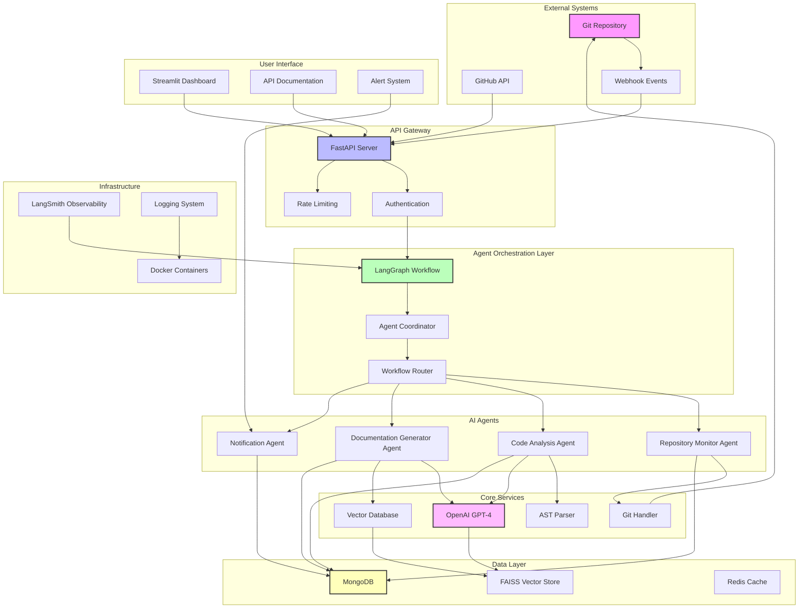
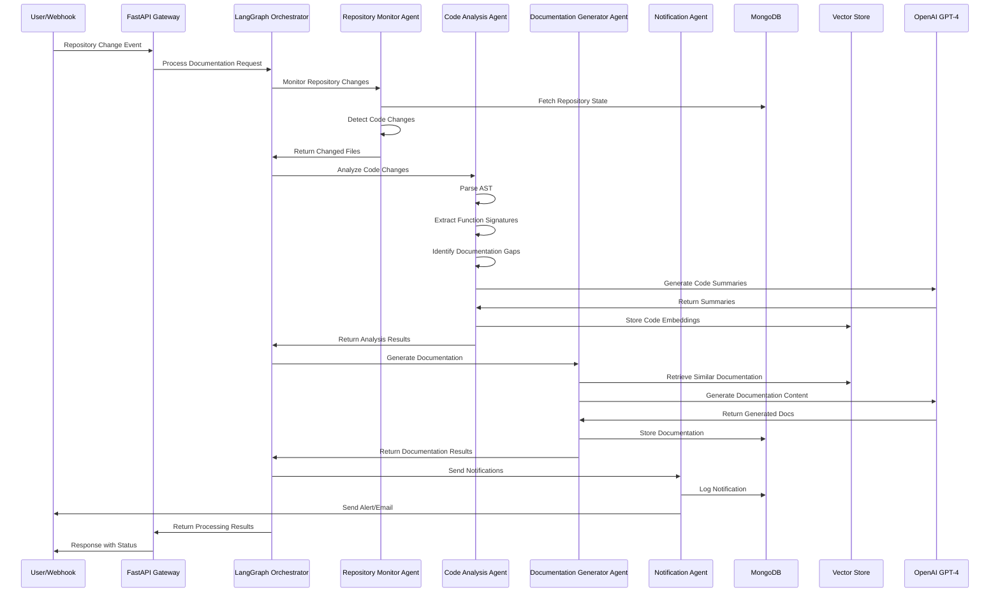
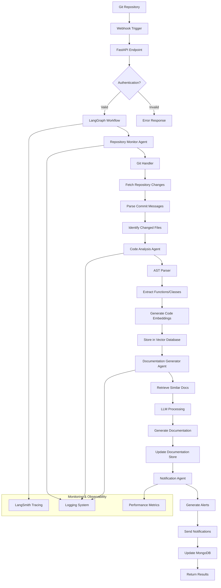
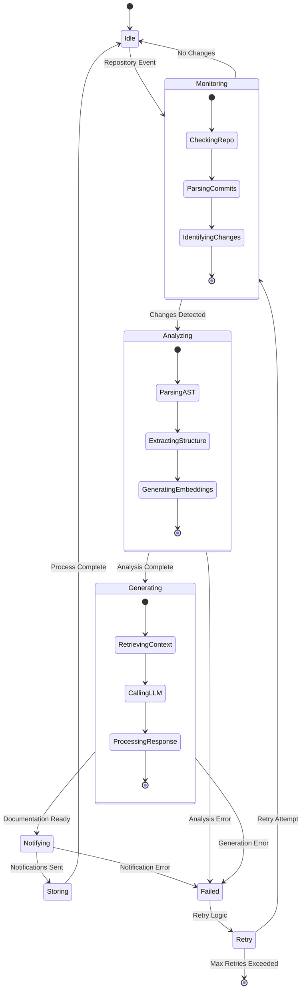
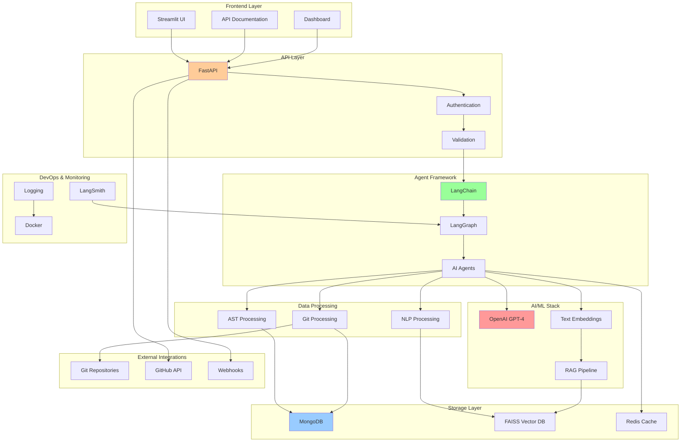
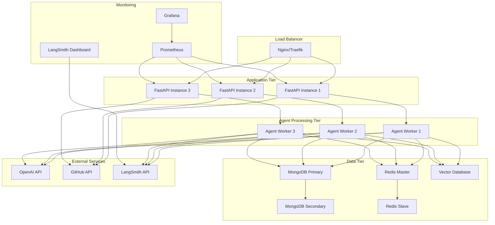

# Automated Code Documentation Assistant - Mermaid Diagrams

## System Architecture Diagram

## Agent Workflow Diagram

## Data Flow Diagram

## Agent State Machine Diagram

## Technology Stack Diagram

## Deployment Architecture

