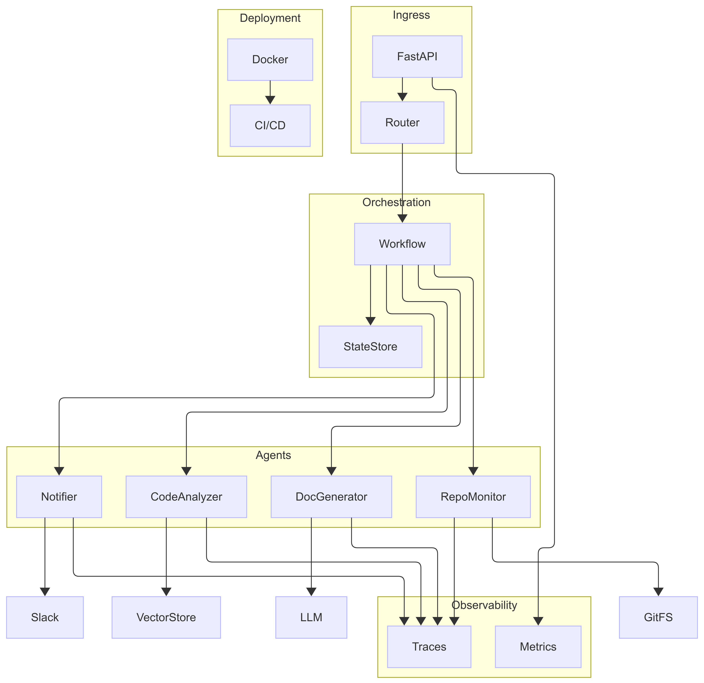

# System Architecture

**Automated Code Documentation Assistant (ACDA)** is a multi-service platform built on an agentic AI core.

| Layer | Components | Key Responsibilities |
|-------|------------|----------------------|
| Ingress | FastAPI, Web-hooks | Accept API calls & Git events |
| Agents | Repository Monitor, Code Analyzer, Doc Generator, Notifier | Autonomously coordinate via LangGraph |
| AI/LLM | OpenAI GPT-4o-mini + RAG (FAISS) | Content generation & semantic search |
| Data | MongoDB, Redis, Vector Store | Metadata, caching, embeddings |
| DevOps | Docker, GitHub Actions, LangSmith, Prometheus | Build, deploy, observe, trace |

## Data-Flow Steps
1. **Webhook/Manual Trigger** → Repository Monitor clones or pulls latest code.
2. **Change Detection** → New commit SHAs stored in MongoDB.
3. **Code Analyzer** parses ASTs (Tree-sitter) and populates function/class registry.
4. **RAG Lookup** retrieves previous docs & context vectors.
5. **Doc Generator** drafts/updates doc-strings via GPT-4o-mini.
6. **Notifier** posts Slack/email updates; LangSmith records traces.
